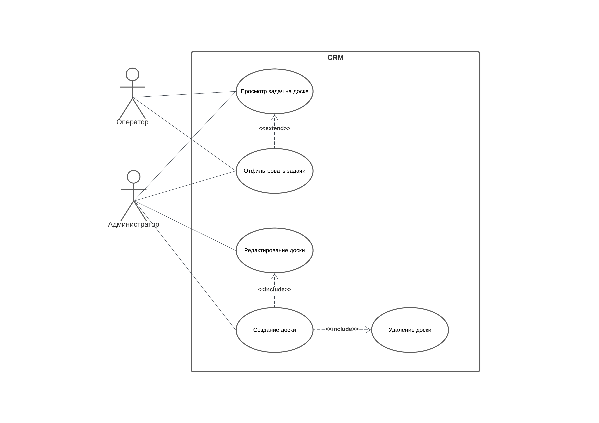
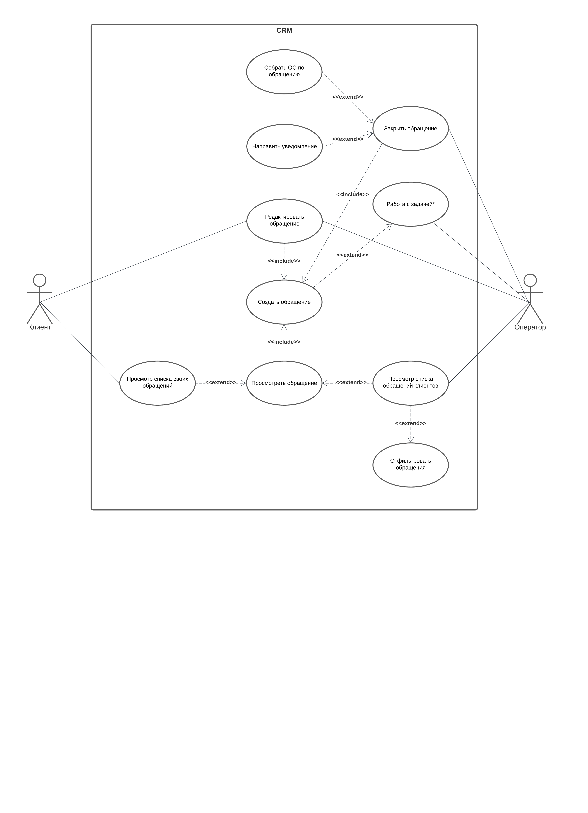
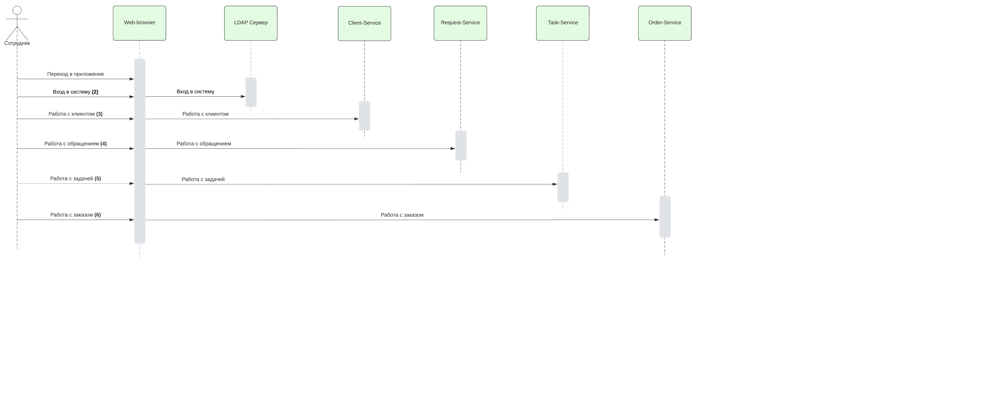
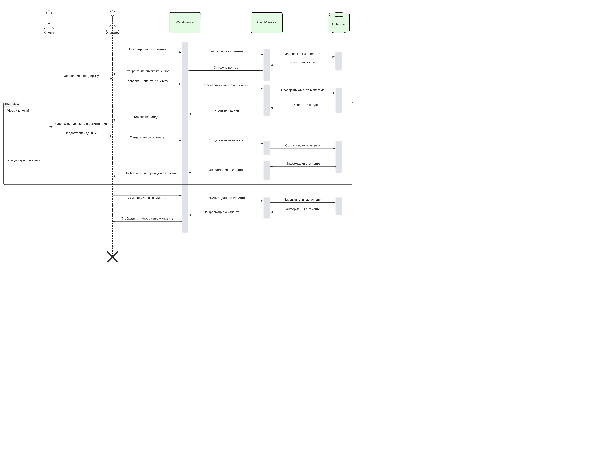
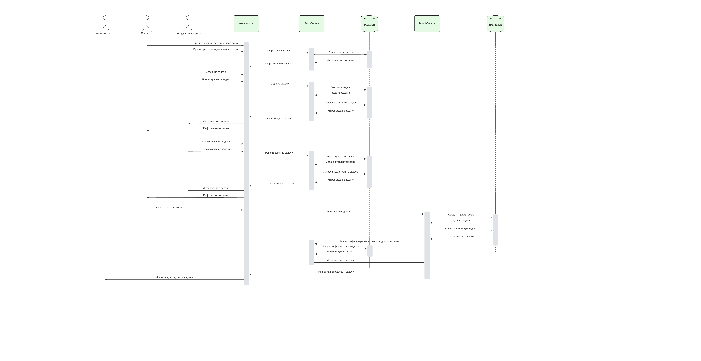
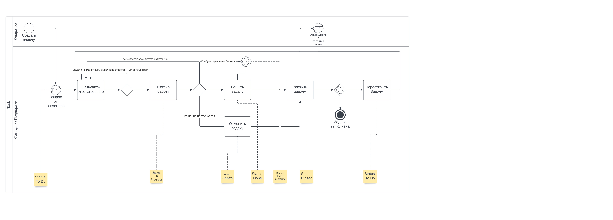
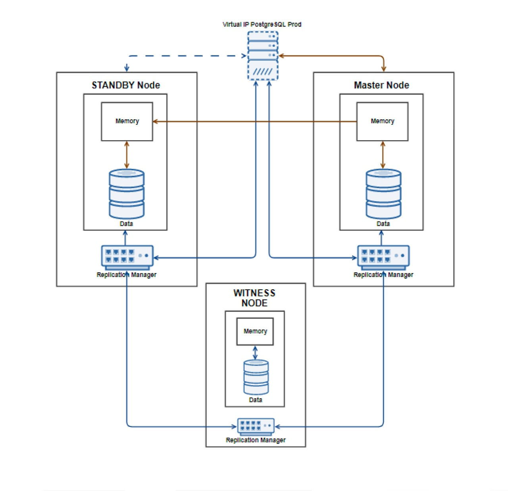

# 
Организационно–технологическое архитектурное решение (ОТАР) по задаче «Развитие CRM системы»

## Оглавление
- [История изменений](#история-изменений)
- [Термины и сокращения](#термины-и-сокращения)
- [Цель проекта/задачи](#цель-проектазадачи)
- [Бизнес-архитектура решения](#бизнес-архитектура-решения)
  * [Функциональная модель процессов](#функциональная-модель-процессов)
- [Информационная архитектура решения](#информационная-архитектура-решения)
  * [Потоки данных](#потоки-данных-data-flow-diagram)
  * [Бизнес-данные](#бизнес-данные)
- [Архитектура приложения](#архитектура-приложения)
  * [Концептуальная модель и интеграция](#концептуальная-модель-и-интеграция)
  * [Перечень компонентов](#перечень-компонентов)
  * [Выбор СУБД](#выбор-субд)
  * [Архитектура БД](#архитектура-бд)
  * [Модель компонентов приложений](#модель-компонентов-приложений)
  * [Модель развертывания приложений](#модель-развертывания-приложений)
  * [Open Api](#open-api)
- [Требования и решения по безопасности](#требования-и-решения-по-безопасности)

### История изменений

| *Номер версии*|    *Дата*   | *Автор изменения* |       *Суть изменения*        |
|:------------:|:------------:|:---------------:|:-------------------------------:|
| 1.0          | 01.12.2022   |                 | Первоначальная версия документа |

### Термины и сокращения
(Доменная модель)
| Термин\Сокращение | Значение         | Автор изменения |          Суть изменения         |
|-------------------|------------------|:---------------:|:-------------------------------:|
| Компания          | ПАО «Ростелеком» |                 | Первоначальная версия документа |
|                   |                  |                 |                                 |
|                   |                  |                 |                                 |

### Цель проекта/задачи

### Бизнес-архитектура решения
| Код | Название бизнес-процесса | Система автоматизации процесса | Интенсивность операций на дату внедрения (м/ч/д) | Интенсивность операций на конец года (м/ч/д) | Интенсивность операций на конец следующего года (м/ч/д) |
|:---:|:------------------------:|:------------------------------:|:------------------------------------------------:|:--------------------------------------------:|:-------------------------------------------------------:|
| БП1 |                          |               CRM              |                    1 / 5 / 15                    |                  1 / 5 / 60                  |                      2 / 935 / 160                      |
|     |                          |                                |                                                  |                                              |                                                         |
|     |                          |                                |                                                  |                                              |                                                         |

#### Функциональная модель процессов

Use-case diagrams

Sequence diagrams

BPMN diagram

### Информационная архитектура решения

#### Потоки данных (data flow diagram)

  
Уровень 0

    

  
Уровень 1

    

#### Бизнес-данные
Можно заполнить по основным сущностям (+ приложить ER)
| № | Название объекта данных | Где хранится (системы) | Статус изменения   объекта данных | Объем данных | Глубина хранения |
|:---:|:---:|:---:|:---:|:---:|:---:|
|   | Событие по клиенту | DWH, CRM | Разработка | 200 ГБ | 5 лет |
|  |  |  |  |  |  |
|  |  |  |  |  |  |

### Архитектура приложения

#### Концептуальная модель и интеграция

  
Показать

   

#### Перечень компонентов
| № | Название системы/модуля/компонента | Тип объекта | Платформа | Назначение | Зона размещения компонента | Статус изменения   компонента |
|:---:|:---:|:---:|:---:|:---:|:---:|:---:|
|   | Client-service | Сервис | RHEL/Docker/Go | Решение для управления клиентами | LAN | Разработка |
|  |  |  |  |  |  |  |
|  |  |  |  |  |  |  |

#### Модель компонентов приложений
(сюда компоненты, классы и т.д.)

#### Выбор СУБД

Для проектируемого решения предлагается использовать следующие СУБД:
-	Postgres Pro Enterprise – для хранения и обработки транзакционных данных.
-	Виртуальное хранилище Ростелеком – для хранения файлов.

Выбор виртуального хранилища Ростелеком обусловлен использованием уже существующей инфраструктуру заказчика и поддержкой распространенного протокола Amazon S3 API.
СУБД Postgres Pro была выбрана в результате оценки критериев сравнения между наиболее распространенными реляционными СУБД (данный тип обеспечивает наиболее эффективную обработку транзакционных данных).

С учетом специфики заказчика, наиболее целесообразным является выбор СУБД Postgres, обладающей следующими преимуществами:
-	отсутствие санкционных рисков использования;
-	наличие вендоров осуществляющих поддержку и развитие на территории РФ;
-	наличие open source версии для исключения vendor lock.

Далее среди отечественных решений на основе СУБД Postgres был выбран продукт, имеющий реализацию высокодоступного (high availability) кластера «из коробки»: СУБД Postgres Pro Enterprise. Основным преимуществом реализации кластера СУБД Postgres Pro Enterprise является:
-	наличие конфигурации multimaster, позволяющей в отличии от других продуктов выполнять масштабирование операций не только на чтение, но и на запись;
-	использование разработанного расширения Postgres (без использования стороннего программного обеспечения) для создания и управления кластером.

 
Показать критерии

   
   

#### Архитектура БД

Репликация

Катастрофоустойчивость

#### Модель развертывания приложений

Диаграмма развертывания

#### Open Api

Open API

### Требования и решения по безопасности
